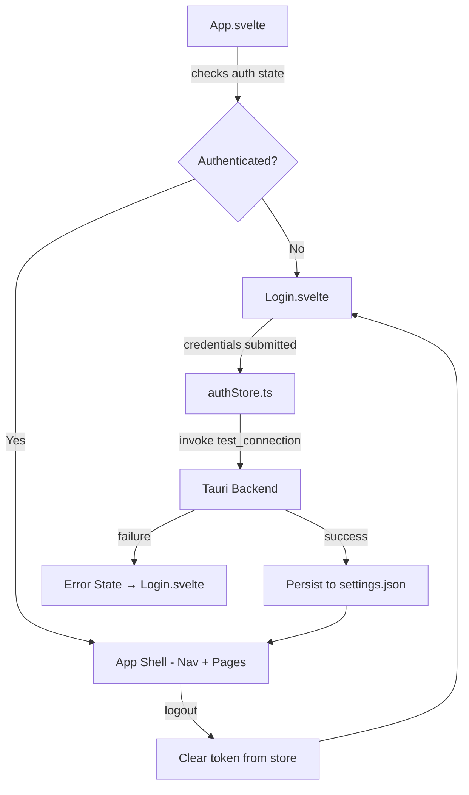
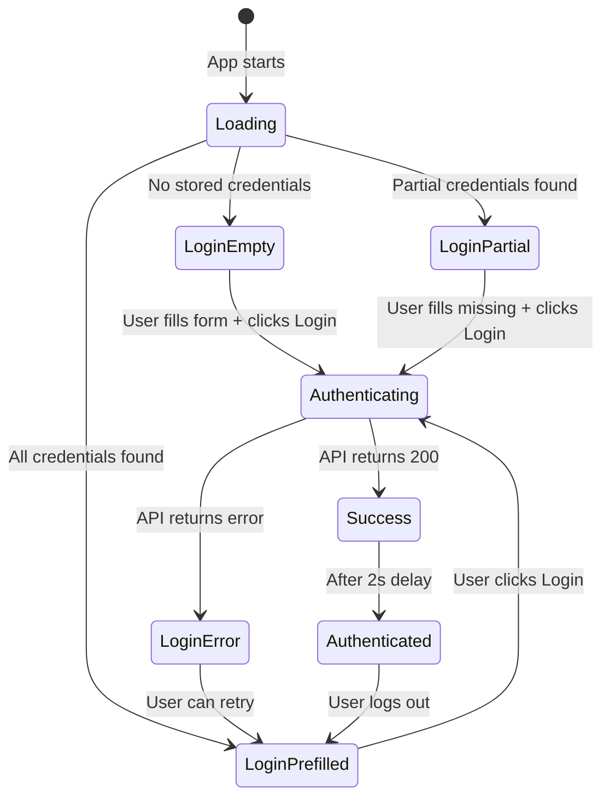
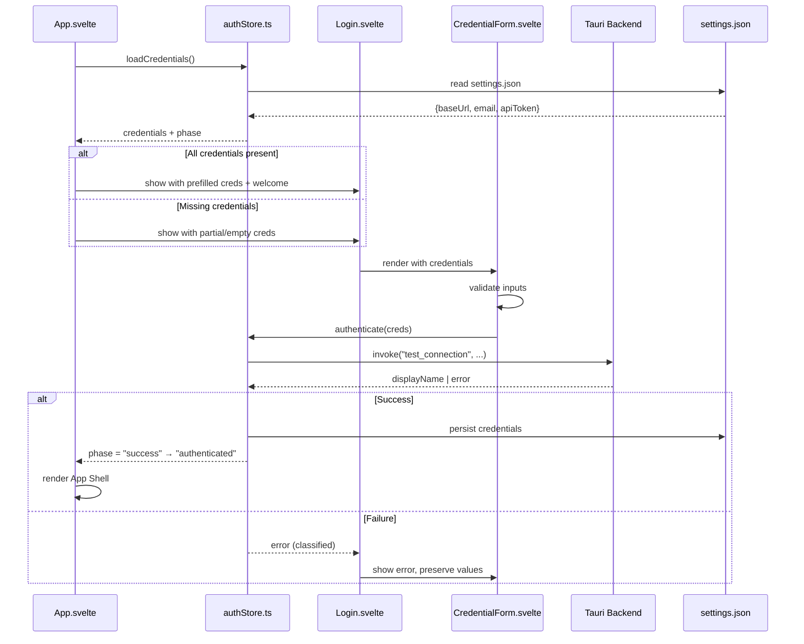

# Design Document: Login Page Revamp

## Overview

This design introduces a dedicated login page to the JIRA Logwork desktop application, replacing the current direct-to-app-shell flow. The login page acts as a gatekeeper: users must authenticate before accessing any Jira-dependent functionality. The page features an animated CSS background, a credential form with client-side validation, and credential persistence via `tauri-plugin-store` for seamless returning-user experience.

The key architectural change is introducing an **authentication state machine** at the `App.svelte` level that determines whether to render the Login page or the App Shell. This state is derived from credential presence in the store and successful API validation.

## Architecture



### High-Level Flow

1. **App startup**: `App.svelte` loads credentials from `settings.json` via `authStore`
2. **Credential check**: If all three fields (URL, email, token) are present and non-empty, show Login page with pre-populated fields and welcome message
3. **Authentication**: User clicks Login → `test_connection` Tauri command validates against Jira API
4. **Success**: Persist credentials, show display name briefly, transition to App Shell
5. **Failure**: Show categorized error, preserve form state, allow retry
6. **Logout**: Clear API token from store, navigate back to Login page

### State Machine



## Components and Interfaces

### New Components

| Component | Path | Responsibility |
|-----------|------|----------------|
| `Login.svelte` | `src/lib/pages/Login.svelte` | Full-screen login page with animated background and credential form |
| `AnimatedBackground.svelte` | `src/lib/components/AnimatedBackground.svelte` | CSS/SVG animated background with reduced-motion support |
| `CredentialForm.svelte` | `src/lib/components/CredentialForm.svelte` | Form with validation, error display, and loading states |
| `authStore.ts` | `src/lib/stores/authStore.ts` | Authentication state management and credential persistence |

### Modified Components

| Component | Changes |
|-----------|---------|
| `App.svelte` | Add auth state check; conditionally render Login vs App Shell; add logout button to nav |

### Component Interfaces

#### authStore.ts

```typescript
// Auth state types
type AuthPhase = "loading" | "unauthenticated" | "authenticating" | "success" | "authenticated";

interface AuthState {
  phase: AuthPhase;
  credentials: Credentials;
  displayName: string | null;
  error: AuthError | null;
}

interface Credentials {
  baseUrl: string;
  email: string;
  apiToken: string;
}

interface AuthError {
  type: "auth" | "network" | "timeout" | "unknown";
  message: string;
}

// Exported functions
function loadCredentials(): Promise<Credentials>;
function saveCredentials(creds: Credentials): Promise<void>;
function authenticate(creds: Credentials): Promise<string>; // returns display name
function logout(): Promise<void>;
function classifyError(error: unknown): AuthError;
```

#### Validation Functions (pure, testable)

```typescript
function isCredentialComplete(creds: Credentials): boolean;
function validateUrl(url: string): { valid: boolean; error?: string };
function validateEmail(email: string): { valid: boolean; error?: string };
function isFormSubmittable(creds: Credentials): boolean;
```

#### CredentialForm.svelte Props

```typescript
interface CredentialFormProps {
  credentials: Credentials;
  isLoading: boolean;
  error: AuthError | null;
  welcomeEmail: string | null; // shown when all creds pre-populated
  onSubmit: (creds: Credentials) => void;
}
```

### Data Flow



## Data Models

### Credential Store Schema (settings.json)

The existing `settings.json` store already contains `baseUrl`, `email`, `apiToken`, and `isCloud` fields. No schema changes are needed — the login page reads and writes the same keys the Settings page currently uses.

```typescript
// Keys in settings.json relevant to auth
interface CredentialStoreSchema {
  baseUrl: string;      // Jira instance URL
  email: string;        // User email
  apiToken: string;     // API token (cleared on logout)
  isCloud: boolean;     // Cloud vs Server (default: true)
}
```

### Auth State (in-memory, reactive)

```typescript
interface AuthState {
  phase: AuthPhase;
  credentials: Credentials;
  displayName: string | null;
  error: AuthError | null;
  hasStoredCredentials: boolean; // all 3 fields present in store
}
```

### Validation Result

```typescript
interface ValidationResult {
  valid: boolean;
  error?: string;
}

interface FormValidation {
  url: ValidationResult;
  email: ValidationResult;
  submittable: boolean;
}
```

## Correctness Properties

*A property is a characteristic or behavior that should hold true across all valid executions of a system — essentially, a formal statement about what the system should do. Properties serve as the bridge between human-readable specifications and machine-verifiable correctness guarantees.*

### Property 1: Credential completeness determines authentication requirement

*For any* set of credential values (baseUrl, email, apiToken), the system SHALL require authentication (show login page) if and only if at least one field is empty or missing.

**Validates: Requirements 1.1**

### Property 2: Form validation disables submission for incomplete input

*For any* combination of three input strings (url, email, token), the Login button SHALL be disabled if and only if at least one string is empty or consists entirely of whitespace characters.

**Validates: Requirements 3.5, 4.3**

### Property 3: URL validation rejects non-HTTPS URLs

*For any* string provided as a Jira URL, validation SHALL reject it (return invalid) if and only if it does not begin with the prefix "https://".

**Validates: Requirements 3.6**

### Property 4: Email validation rejects invalid formats

*For any* string provided as an email, validation SHALL reject it if it does not match a valid email format (contains at least one character before @, an @ symbol, and a domain with at least one dot).

**Validates: Requirements 3.7**

### Property 5: Credential persistence round-trip

*For any* valid set of credentials (non-empty baseUrl, email, apiToken), saving them to the credential store and then loading them back SHALL produce values identical to the original input.

**Validates: Requirements 4.1, 4.2**

### Property 6: Partial credential loading preserves available fields

*For any* subset of credential fields stored (where at least one field is empty/missing), loading credentials SHALL return exactly the stored non-empty values for present fields and empty strings for missing fields, and SHALL NOT trigger the welcome message.

**Validates: Requirements 4.4, 7.2**

### Property 7: Error classification is exhaustive and correct

*For any* error returned by the authentication service, the error classifier SHALL categorize it as exactly one of: "auth" (HTTP 401/403), "network" (connection/DNS failures), "timeout" (30s exceeded), or "unknown" (all other errors).

**Validates: Requirements 6.1, 6.2, 6.5**

### Property 8: Form state preservation after authentication failure

*For any* set of credentials entered in the form and any authentication error, after the error is displayed, the form SHALL contain the same credential values that were present before the authentication attempt.

**Validates: Requirements 6.3**

### Property 9: Welcome message contains stored email

*For any* valid email address stored in the credential store (when all three credential fields are present), the welcome message displayed on the login page SHALL contain that email address as a substring.

**Validates: Requirements 7.1**

### Property 10: Authentication failure clears only the API token

*For any* set of stored credentials where authentication fails with an auth error (401/403), the resulting credential state SHALL have an empty apiToken field while retaining the original baseUrl and email values unchanged.

**Validates: Requirements 7.4**

### Property 11: Logout clears only the API token

*For any* set of stored credentials, performing a logout operation SHALL result in the apiToken being cleared from the credential store while the baseUrl and email values remain unchanged.

**Validates: Requirements 8.2**

## Error Handling

### Error Classification Strategy

Errors from the `test_connection` Tauri command are string-based (Rust's `Err(String)`). The frontend classifies them:

| Error Pattern | Classification | User Message |
|---------------|---------------|--------------|
| Contains "HTTP 401" or "HTTP 403" | `auth` | "Invalid credentials. Please check your email and API token." |
| Contains "HTTP 404" | `auth` | "Jira instance not found. Please check your URL." |
| Contains "dns", "connect", "resolve", or reqwest connection errors | `network` | "Cannot reach the server. Please check your URL and network connection." |
| Timeout (30s exceeded) | `timeout` | "Connection timed out. Please try again." |
| All other errors | `unknown` | "An unexpected error occurred. Please try again." |

### Error Recovery Flows

1. **Auth error (invalid credentials)**: Form remains visible, all fields editable, Login button re-enabled. If credentials were pre-populated from store, the API token field is cleared.
2. **Network error**: Form remains visible, all fields intact, Login button re-enabled. User can retry immediately.
3. **Timeout**: Same as network error. The promise is rejected after 30s via `Promise.race` with a timeout.
4. **Store read failure on startup**: Silently degrade to empty form. No error shown to user.
5. **Store write failure on logout**: Navigate to login page anyway, show warning that session may not be fully cleared.

### Timeout Implementation

```typescript
async function authenticateWithTimeout(creds: Credentials, timeoutMs = 30000): Promise<string> {
  const authPromise = invoke<string>("test_connection", {
    baseUrl: creds.baseUrl,
    email: creds.email,
    apiToken: creds.apiToken,
    isCloud: true
  });
  const timeoutPromise = new Promise<never>((_, reject) =>
    setTimeout(() => reject(new Error("timeout")), timeoutMs)
  );
  return Promise.race([authPromise, timeoutPromise]);
}
```

## Testing Strategy

### Property-Based Testing

**Library**: [fast-check](https://github.com/dubzzz/fast-check) (JavaScript PBT library, well-suited for Svelte/TypeScript projects)

**Configuration**: Minimum 100 iterations per property test.

Property-based tests target the pure logic layer extracted into `authStore.ts`:
- Validation functions (`isCredentialComplete`, `validateUrl`, `validateEmail`, `isFormSubmittable`)
- Error classification (`classifyError`)
- Credential state derivation logic

Each property test is tagged with:
```
// Feature: login-page-revamp, Property {N}: {property_text}
```

### Unit Tests (Example-Based)

- Login page renders correctly in each state (loading, empty, prefilled, error, success)
- Animated background respects `prefers-reduced-motion`
- Form field rendering (labels, placeholders, input types)
- Loading indicator shown during authentication
- Success message displays user name and transitions after 2s
- Logout button present in App Shell nav

### Integration Tests

- Full login flow: fill form → click Login → mock Tauri invoke → verify transition to App Shell
- Credential persistence: save → reload app → verify pre-populated form
- Logout flow: click logout → verify navigation to login page with correct field state

### Test File Structure

```
src/lib/stores/__tests__/
  authStore.test.ts          # Unit + property tests for auth logic
  authStore.property.test.ts # Property-based tests (fast-check)
src/lib/components/__tests__/
  CredentialForm.test.ts     # Component rendering tests
  Login.test.ts              # Page-level integration tests
```
