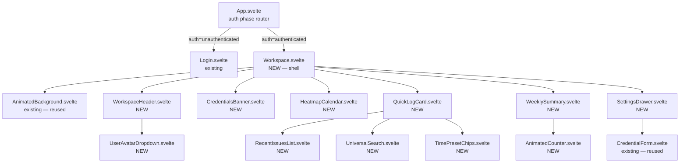
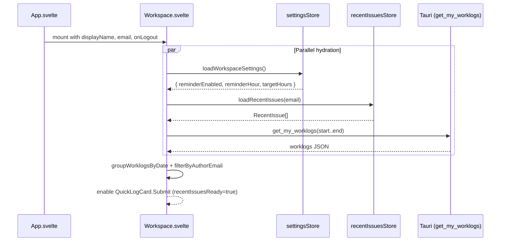
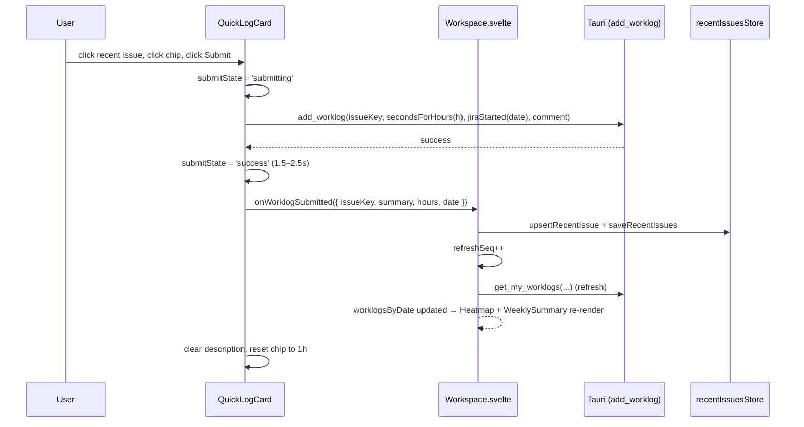
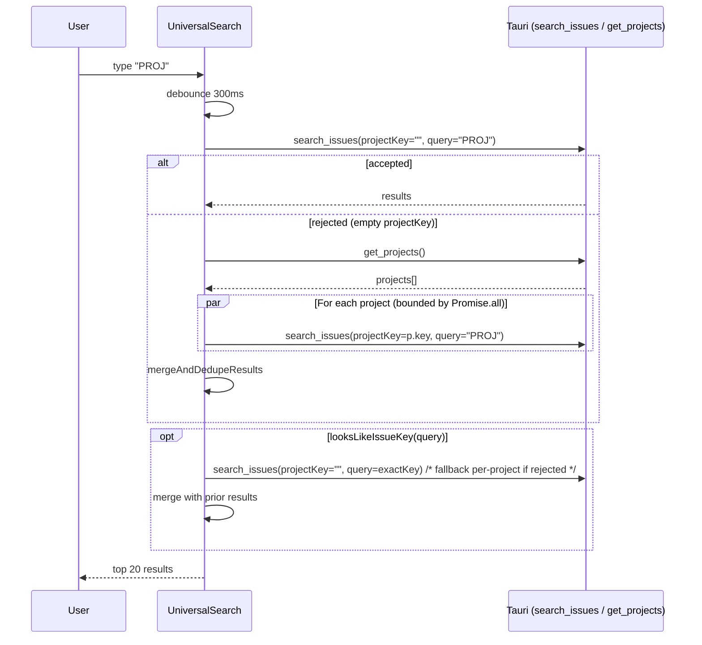

# Design Document

## Overview

The workspace-revamp feature replaces the post-login UI of the JIRA Logwork desktop application (Svelte 5 + Tauri 2) with a single-page **Workspace_Shell** that composes a compact **Header**, **Heatmap_Calendar**, **Quick_Log_Card**, **Weekly_Summary**, and a **Settings_Drawer** over the existing animated background. The goal is to make logging time fast (≤ 3 s for a recent issue) while keeping the polished glass-morphism aesthetic of the login page.

This is a **front-end-only change**. No new Tauri commands, no Rust changes, no backend schema. The five existing commands — `test_connection`, `get_my_worklogs`, `get_projects`, `search_issues`, `add_worklog` — are sufficient. The legacy `Calendar.svelte`, `Settings.svelte`, `CalendarGrid.svelte`, `LogworkModal.svelte`, `ActivityPanel.svelte` and the entire ActivityWatch wiring are removed.

Persistence layers in use:

| Store | File | Purpose |
| --- | --- | --- |
| `tauri-plugin-store` | `settings.json` (existing) | Credentials + `reminderEnabled`, `reminderHour`, `targetHours`, `isCloud` |
| `tauri-plugin-store` | `recent-issues.json` (new) | Per-user recent-issue cache, keyed by lowercased email |
| `tauri-plugin-store` | `offline-queue.json` (existing) | Pending worklogs awaiting sync |

### Design Goals

1. **Speed**: ≤ 3 s from intent-to-log to API call when reusing a recent issue.
2. **Simplicity**: Single page, single search field, no project pre-selection.
3. **Continuity**: Same animated background, same glass tokens, same fonts as login.
4. **Resilience**: Offline-friendly via the existing `offlineStore`; recoverable from persistence errors.
5. **Accessibility**: Full keyboard nav, focus trap in drawer, AA contrast, reduced-motion support.

### Non-Goals

- Editing or deleting existing worklogs (out of scope).
- Multi-user support beyond the per-email recent-issues partition.
- Custom heatmap ranges other than the 12-week default and a small set of presets.
- Replacing the Login page or `AnimatedBackground.svelte`.

## Architecture

### Component Hierarchy



### File Layout (New & Changed)

```
src/
├── App.svelte                              [MODIFIED] route to Workspace, drop Calendar/Settings imports
├── lib/
│   ├── pages/
│   │   ├── Workspace.svelte                [NEW] shell
│   │   ├── Calendar.svelte                 [DELETED]
│   │   └── Settings.svelte                 [DELETED]
│   ├── components/
│   │   ├── AnimatedBackground.svelte       [UNCHANGED] reused
│   │   ├── CredentialForm.svelte           [UNCHANGED] reused inside Drawer
│   │   ├── WorkspaceHeader.svelte          [NEW]
│   │   ├── UserAvatarDropdown.svelte       [NEW]
│   │   ├── CredentialsBanner.svelte        [NEW]
│   │   ├── HeatmapCalendar.svelte          [NEW]
│   │   ├── QuickLogCard.svelte             [NEW]
│   │   ├── RecentIssuesList.svelte         [NEW]
│   │   ├── UniversalSearch.svelte          [NEW]
│   │   ├── TimePresetChips.svelte          [NEW]
│   │   ├── WeeklySummary.svelte            [NEW]
│   │   ├── AnimatedCounter.svelte          [NEW]
│   │   ├── SettingsDrawer.svelte           [NEW]
│   │   ├── CalendarGrid.svelte             [DELETED]
│   │   ├── LogworkModal.svelte             [DELETED]
│   │   └── ActivityPanel.svelte            [DELETED]
│   └── stores/
│       ├── authStore.ts                    [UNCHANGED]
│       ├── offlineStore.ts                 [UNCHANGED]
│       ├── worklogStore.ts                 [UNCHANGED] reused for grouping
│       ├── recentIssuesStore.ts            [NEW] cache I/O + pure logic
│       ├── heatmapStore.ts                 [NEW] pure logic: bucketing, range
│       ├── searchStore.ts                  [NEW] pure logic: regex, merge/dedupe
│       └── settingsStore.ts                [NEW] reminder/target validation + I/O
```

### State Ownership

State is co-located as low as possible, lifted only when shared across siblings.

| State | Owner | Reason |
| --- | --- | --- |
| `authPhase`, `credentials`, `displayName` | `App.svelte` | Already global; gates render of Workspace. |
| `selectedDate` (`YYYY-MM-DD`) | `Workspace.svelte` | Shared between Heatmap (selection) and QuickLogCard (target date). |
| `recentIssues: RecentIssue[]` | `Workspace.svelte` | Shared between QuickLogCard (display, click) and the upsert path on submission. |
| `worklogsByDate: Record<string, WorklogDay>` | `Workspace.svelte` | Shared between Heatmap (cells) and WeeklySummary (totals). |
| `workspaceSettings: WorkspaceSettings` | `Workspace.svelte` | Drives `targetHours` consumed by WeeklySummary. |
| `settingsDrawerOpen: boolean` | `Workspace.svelte` | Triggered by Header, renders Drawer. |
| `refreshSeq: number` | `Workspace.svelte` | Bumped after submit / sync, observed by Heatmap + WeeklySummary as a refetch signal. |
| `searchQuery`, `searchResults`, `searchInFlight` | `UniversalSearch.svelte` | Local input state. |
| `selectedChip`, `customHours`, `description` | `QuickLogCard.svelte` | Form state for in-flight worklog. |
| `tooltipCell` | `HeatmapCalendar.svelte` | Hover-only UI. |
| `isOpen`, `focusedItem` | `UserAvatarDropdown.svelte` | Menu state. |

### Why Workspace owns `recentIssues` and `worklogsByDate`

The Workspace is the only component that observes both **submission events** (from QuickLogCard) and **fetch results** (Heatmap), and it must mutate both atomically when a worklog is submitted (cache upsert + heatmap refresh). Pushing this down would force prop-drilling callbacks back up.

## Components and Interfaces

All props use Svelte 5 `$props` runes with TypeScript interfaces. Callback props are named `on<Event>` (camelCase) to follow the `CredentialForm.svelte` precedent.

### Workspace.svelte

```typescript
interface Props {
  displayName: string;        // From App.svelte
  email: string;              // From App.svelte (used as cache key)
  onLogout: () => void;       // From App.svelte; calls authStore.logout, flips authPhase
}
```

Renders `AnimatedBackground` + a 12-column responsive grid:

```
┌──────────────────────────────────────────────────────────────┐
│ Header (WorkspaceHeader)                                      │
├───────────────────────┬──────────────────────────────────────┤
│                       │                                       │
│  HeatmapCalendar      │   QuickLogCard                        │
│  (col-span-8)         │   (col-span-4)                        │
│                       │                                       │
├───────────────────────┴──────────────────────────────────────┤
│ WeeklySummary (full width)                                    │
└──────────────────────────────────────────────────────────────┘
```

`SettingsDrawer` overlays from the right when open. `CredentialsBanner` slides in below the Header when credentials are incomplete.

### WorkspaceHeader.svelte

```typescript
interface Props {
  displayName: string;
  email: string;
  onOpenSettings: () => void;
  onLogout: () => void;
}
```

Layout: logo + "JIRA Logwork" on the left, locale long date in the center (e.g. `Wednesday, March 12, 2025`), `UserAvatarDropdown` on the right.

### UserAvatarDropdown.svelte

```typescript
interface Props {
  displayName: string;
  email: string;
  onOpenSettings: () => void;
  onLogout: () => void;
}
```

- Avatar shows initial of `displayName || email`.
- Click or Enter/Space opens menu; Escape, outside click, or focus-out closes.
- Menu items use `role="menuitem"`; container uses `role="menu"` with `aria-orientation="vertical"`. Up/Down arrow keys cycle items.
- Menu is **only** rendered while open; the keyboard handlers are attached on the same render pass so the menu cannot open without them (R13.4).

### CredentialsBanner.svelte

```typescript
interface Props {
  show: boolean;
  onOpenSettings: () => void;
}
```

Non-blocking glass banner: "Connection setup is incomplete. Open Settings to finish." with a button that calls `onOpenSettings`.

### HeatmapCalendar.svelte

```typescript
interface Props {
  worklogsByDate: Record<string, WorklogDay>;
  isLoading: boolean;
  error: string | null;
  weeks: number;             // default 12
  selectedDate: string | null;
  onSelectDate: (date: string) => void;
  onChangeRange: (weeks: number) => void;
  onRetry: () => void;
}
```

- Internally computes `cells: HeatmapCell[]` from `worklogsByDate` via `buildHeatmap(worklogsByDate, weeks, today)` (pure, in `heatmapStore.ts`).
- Cells laid out as columns of 7 (Sun–Sat), week-major.
- Each cell is a `<button>` with `aria-label="{localeDate}, {hours.toFixed(1)} hours"`.
- Hover tooltip uses `<div role="tooltip">`.
- Skeleton: 12 × 7 placeholder squares with shimmer when `isLoading`.
- Error state: inline message + Retry button calling `onRetry`.

### QuickLogCard.svelte

```typescript
interface Props {
  recentIssues: RecentIssue[];
  recentIssuesReady: boolean;     // false until cache loaded; disables Submit per R14.3
  recentIssuesError: string | null;
  selectedDate: string;            // YYYY-MM-DD, defaulted by Workspace
  email: string;
  baseUrl: string;
  apiToken: string;
  isCloud: boolean;
  onWorklogSubmitted: (e: WorklogSubmitted) => void;
  onWorklogQueued: (e: WorklogSubmitted) => void;
}

interface WorklogSubmitted {
  issueKey: string;
  summary: string;
  hours: number;
  date: string;       // YYYY-MM-DD
}
```

State (`$state`):

- `selectedIssue: { key: string; summary: string } | null`
- `chipHours: 0.5 | 1 | 2 | 4 | 8 | null` (default `1`)
- `customHours: number | null`
- `description: string` (≤ 500 chars)
- `submitState: 'idle' | 'submitting' | 'success' | 'error' | 'queued'`
- `submitError: string | null`

Derived (`$derived`):

- `effectiveHours = customHours ?? chipHours ?? 0`
- `canSubmit = recentIssuesReady && selectedIssue !== null && effectiveHours > 0 && submitState !== 'submitting'`

Submission flow detailed below in Data Flow.

### RecentIssuesList.svelte

```typescript
interface Props {
  issues: RecentIssue[];
  selectedKey: string | null;
  onSelect: (issue: RecentIssue) => void;
}
```

Empty state: "No recent issues. Use the search below to find one."

### UniversalSearch.svelte

```typescript
interface Props {
  baseUrl: string;
  email: string;
  apiToken: string;
  isCloud: boolean;
  onSelect: (issue: { key: string; summary: string }) => void;
}
```

Internal state:
- `query: string`, `results: SearchResult[]`, `inFlight: boolean`, `error: string | null`.
- Debounce: 300 ms via cancellable timer.
- Behavior: when `query.length >= 2`, after debounce, run `searchAll(...)` from `searchStore.ts`. Up to 20 results displayed.
- If query matches `^[A-Z][A-Z0-9_]+-\d+$` (case-insensitively), the exact key is also queried via `search_issues` and merged.

### TimePresetChips.svelte

```typescript
interface Props {
  value: 0.5 | 1 | 2 | 4 | 8 | null;
  onChange: (value: 0.5 | 1 | 2 | 4 | 8) => void;
}
```

- `role="radiogroup"`, each chip `role="radio"` with `aria-checked`.
- Left/Right arrows move selection; Space/Enter selects.

### WeeklySummary.svelte

```typescript
interface Props {
  worklogsByDate: Record<string, WorklogDay>;
  targetHours: number;     // single-day target; weekly target = targetHours * 5
  isLoading: boolean;
  today: Date;
}
```

- Computes `weeklyTotal = sumWeekHours(worklogsByDate, today)` (ISO week, Mon–Sun).
- `weeklyTarget = targetHours * 5`.
- `progress = clamp01(weeklyTotal / weeklyTarget)` (with `weeklyTarget === 0 → 0`).
- Animates `weeklyTotal` via `AnimatedCounter`.

### AnimatedCounter.svelte

```typescript
interface Props {
  value: number;
  duration?: number;       // 200..800ms; default 600
  fractionDigits?: number; // default 1
}
```

- Uses `requestAnimationFrame`, eases from previous to new value.
- When `prefers-reduced-motion: reduce`, jumps directly to `value`.

### SettingsDrawer.svelte

```typescript
interface Props {
  open: boolean;
  initialSettings: WorkspaceSettings;
  initialCredentials: Credentials;
  initialIsCloud: boolean;
  onClose: () => void;
  onSettingsSaved: (next: WorkspaceSettings) => void;
  onCredentialsSaved: (next: Credentials, isCloud: boolean) => void;
}
```

- Renders three sections (Jira Connection, Reminder, Target Hours).
- Jira Connection embeds `CredentialForm.svelte` (existing) + a Cloud/Server toggle.
- Validates per requirements before save (see `validateWorkspaceSettings` in Data Models).
- Focus trap implementation: capture first/last focusable elements, redirect Tab/Shift+Tab.
- Animation: `transform: translateX(100%)` ↔ `translateX(0)` over 250 ms; backdrop fades 200 ms; both disabled under `prefers-reduced-motion`.

## Data Models

All models live in TypeScript stores under `src/lib/stores/`.

### RecentIssue

```typescript
// src/lib/stores/recentIssuesStore.ts
export interface RecentIssue {
  issueKey: string;     // e.g., "PROJ-123"
  summary: string;      // raw issue summary from Jira
  lastUsedAt: string;   // ISO 8601 string from new Date().toISOString()
}

export const RECENT_ISSUES_MAX = 10;

/**
 * Pure: upsert an issue into the cache, bump its lastUsedAt to `now`,
 * sort most-recent-first, and trim to RECENT_ISSUES_MAX.
 */
export function upsertRecentIssue(
  cache: RecentIssue[],
  issue: { issueKey: string; summary: string },
  now: Date = new Date()
): RecentIssue[];

/** Pure: normalize an email to its cache-key form. */
export function cacheKeyForEmail(email: string): string; // email.trim().toLowerCase()

/** I/O: load cache for the given email (returns [] on any error). */
export async function loadRecentIssues(email: string): Promise<RecentIssue[]>;

/** I/O: persist cache for the given email. */
export async function saveRecentIssues(email: string, cache: RecentIssue[]): Promise<void>;
```

**Persistence schema** for `recent-issues.json`:

```json
{
  "user@example.com":  [{ "issueKey": "PROJ-1", "summary": "Fix bug",  "lastUsedAt": "2025-03-12T09:30:00.000Z" }],
  "other@example.com": [{ "issueKey": "OPS-7",  "summary": "Deploy",   "lastUsedAt": "2025-03-11T14:00:00.000Z" }]
}
```

The whole file is one JSON object stored under the single key `"users"` of the Tauri store; per-user lists are values. Keys are lowercased, trimmed emails. The cache is **never** deleted on logout (R14.5).

### HeatmapCell

```typescript
// src/lib/stores/heatmapStore.ts
export interface WorklogDay { totalHours: number; entries: { issueKey: string; hours: number }[]; }

export interface HeatmapCell {
  date: string;        // YYYY-MM-DD
  hours: number;       // sum of hours that day
  intensity: 0|1|2|3|4;
}

/** Pure: bucket hours into one of five intensity levels (R5.2). */
export function intensityFor(hours: number): 0|1|2|3|4;
// 0 → 0 hours
// 1 → 0 < h < 2
// 2 → 2 ≤ h < 4
// 3 → 4 ≤ h < 8
// 4 → h ≥ 8

/** Pure: produce 12 weeks of cells ending on the week containing `today`. */
export function buildHeatmap(
  worklogsByDate: Record<string, WorklogDay>,
  weeks: number,
  today: Date
): { range: { startDate: string; endDate: string }; cells: HeatmapCell[] };

/** Pure: filter a Jira worklog response to entries whose author email matches (case-insensitively). */
export function filterByAuthorEmail(
  worklogs: { author?: { emailAddress?: string } }[],
  email: string
): typeof worklogs;
```

### Search

```typescript
// src/lib/stores/searchStore.ts
export interface SearchResult { key: string; summary: string; }

export const ISSUE_KEY_REGEX = /^[A-Z][A-Z0-9_]+-\d+$/i;

/** Pure: detect issue-key-shaped queries (R7.4). */
export function looksLikeIssueKey(query: string): boolean;

/** Pure: merge multiple result lists, dedupe by key, preserving first-seen order. */
export function mergeAndDedupeResults(lists: SearchResult[][]): SearchResult[];

/**
 * I/O: orchestrates Universal Search per R7.2/R7.3.
 *  - First tries `search_issues` with projectKey="".
 *  - On rejection of empty projectKey, fans out across get_projects() and merges.
 *  - If query looks like an issue key, also queries the exact key and merges.
 */
export async function searchAll(
  ctx: { baseUrl: string; email: string; apiToken: string; isCloud: boolean },
  query: string
): Promise<SearchResult[]>;
```

### Workspace Settings

```typescript
// src/lib/stores/settingsStore.ts
export interface WorkspaceSettings {
  reminderEnabled: boolean;
  reminderHour: number;   // integer 8..22 inclusive (R4.5)
  targetHours: number;    // 1..12 inclusive, multiple of 0.5 (R4.5)
}

export interface SettingsValidation {
  valid: boolean;
  errors: { reminderHour?: string; targetHours?: string };
}

/** Pure: validate per R4.5. */
export function validateWorkspaceSettings(s: WorkspaceSettings): SettingsValidation;

/** Pure: weekly target derived from targetHours per R10.2. */
export function weeklyTarget(targetHours: number): number; // targetHours * 5

/** Pure: clamp progress to [0, 1] per R10.3. */
export function clamp01(x: number): number;

/** Pure: jiraStarted("YYYY-MM-DD") -> "YYYY-MM-DDT09:00:00.000+0000" per R9.3. */
export function jiraStarted(date: string): string;

/** Pure: secondsForHours(h) = Math.round(h * 3600) per R9.3. */
export function secondsForHours(h: number): number;

/** I/O */
export async function loadWorkspaceSettings(): Promise<WorkspaceSettings>;
export async function saveWorkspaceSettings(s: WorkspaceSettings): Promise<void>;
```

### Glass-Morphism Style Tokens

Defined as CSS custom properties in `src/app.css`. Components reference tokens, never raw values, so the visual language stays consistent with the login page.

```css
:root {
  --glass-bg:        rgba(255, 255, 255, 0.05);
  --glass-bg-strong: rgba(255, 255, 255, 0.08);
  --glass-border:    rgba(255, 255, 255, 0.10);
  --glass-blur:      20px;
  --glass-shadow:    0 25px 50px -12px rgba(0, 0, 0, 0.5),
                     inset 0 1px 0 rgba(255, 255, 255, 0.1);
  --glass-radius:    1.25rem;

  --accent-from:     #6366f1;   /* indigo-500 */
  --accent-to:       #8b5cf6;   /* violet-500 */
  --focus-ring:      0 0 0 3px rgba(99, 102, 241, 0.55);

  --intensity-0:     rgba(255, 255, 255, 0.06);
  --intensity-1:     rgba(99, 102, 241, 0.25);
  --intensity-2:     rgba(99, 102, 241, 0.45);
  --intensity-3:     rgba(99, 102, 241, 0.70);
  --intensity-4:     rgba(139, 92, 246, 0.95);
}
```

A reusable `.glass` utility class applies `background: var(--glass-bg); backdrop-filter: blur(var(--glass-blur)); border: 1px solid var(--glass-border); box-shadow: var(--glass-shadow); border-radius: var(--glass-radius);`.

### Animation Strategy

| Element | Animation | Duration | Easing | Reduced-motion fallback |
| --- | --- | --- | --- | --- |
| Workspace mount | fade + translateY(8px) | 400 ms | `ease-out` | instant |
| Card mount stagger | per-child delay 0/80/160 ms | as above | as above | instant |
| Hover (button/chip/cell/recent-row) | bg + border opacity tween | 200 ms | `ease-out` | unchanged (cheap) |
| Focus ring | box-shadow tween | 150 ms | `ease-out` | unchanged |
| Drawer open/close | translateX 100%↔0 + backdrop fade | 250 ms | `cubic-bezier(0.22, 1, 0.36, 1)` | instant open/close, no slide |
| Counter | rAF tween from previous to next value | 200..800 ms (default 600) | `easeOutCubic` | jump to final value |
| Submit success flash | scale(1→1.02→1) + green border | 1500..2500 ms total | `ease-out` | hide visual flash, keep text |
| Cell tooltip | opacity | 120 ms | `ease-out` | instant |

All transforms use `transform`/`opacity` only to stay GPU-accelerated, matching `AnimatedBackground.svelte`.

## Data Flow

### Authenticated bootstrap



The three loads run concurrently. The Submit button stays disabled until `loadRecentIssues` resolves (R14.3); the heatmap shows a skeleton until worklogs resolve.

If `loadRecentIssues` rejects, `recentIssuesError` is set; Submit stays disabled and the banner area shows the error (R14.4).
If credentials are incomplete, `CredentialsBanner` shows and the worklog fetch is skipped (R15.7).

### Quick log submission (online happy path)



### Quick log submission (offline / network error)

```mermaid
sequenceDiagram
  participant QLC as QuickLogCard
  participant Jira as Tauri (add_worklog)
  participant Off as offlineStore
  participant WS as Workspace.svelte
  participant RIS as recentIssuesStore

  QLC->>Jira: add_worklog(...)
  Jira--xQLC: network error
  QLC->>Off: addPendingWorklog({ issueKey, timeSpentSeconds, started, comment })
  alt enqueue ok
    Off-->>QLC: ok
    QLC->>QLC: submitState = 'queued' ("Queued for sync")
    QLC->>WS: onWorklogQueued({...})
    WS->>RIS: upsertRecentIssue (R15.5)
  else enqueue failed
    Off--xQLC: error
    QLC->>QLC: submitState = 'error'
  end
```

Network-vs-other classification reuses the existing `classifyError` from `authStore.ts` (`type === "network"` → enqueue path).

### Background sync refresh

```mermaid
sequenceDiagram
  participant Off as offlineStore
  participant WS as Workspace.svelte
  participant Jira as Tauri (get_my_worklogs)

  Off->>Off: syncPendingWorklogs() (existing 30s interval)
  Off-->>WS: { synced, failed }  (subscribed by WS)
  WS->>WS: refreshSeq++
  WS->>Jira: get_my_worklogs(...) re-fetch
```

Per R15.6, the refresh fires regardless of `synced`/`failed` counts.

### Universal Search



A new keystroke before the debounce timer fires cancels the prior timer; an in-flight request is ignored if a newer query has been submitted (request id check inside `searchAll`).

### Heatmap selection → Quick log target date

When the user clicks a heatmap cell, `HeatmapCalendar` calls `onSelectDate(date)`. Workspace updates `selectedDate`. The Quick Log Card receives the new `selectedDate` via prop and prefills its target date (R5.7, R9.8).

### Logout

The User Avatar Dropdown's Logout entry calls `onLogout` which is the prop wired by `App.svelte` to its own `onLogout` (which calls `authStore.logout` then flips `authPhase`). The Workspace **does not** re-implement logout (R16.4). The recent-issues cache is preserved (R14.5).

## Correctness Properties


*A property is a characteristic or behavior that should hold true across all valid executions of a system — essentially, a formal statement about what the system should do. Properties serve as the bridge between human-readable specifications and machine-verifiable correctness guarantees.*

The Workspace is mostly a UI shell, but it has a meaningful pure-logic surface — bucketing, validation, debouncing, dedupe, transforms, and cache invariants — that benefits from property-based testing. Each property below is universally quantified and references the requirements it validates.

### Property 1: Recent issues upsert maintains cache invariants

*For any* prior `RecentIssue[]` cache (length 0 to N), any new `{ issueKey, summary }`, and any `now: Date`, the result of `upsertRecentIssue(cache, issue, now)` SHALL satisfy ALL of: (a) `result[0].issueKey === issue.issueKey`, (b) `result[0].summary === issue.summary`, (c) `result[0].lastUsedAt === now.toISOString()`, (d) `result.length ≤ 10`, (e) `result` is sorted by `lastUsedAt` in non-increasing order, (f) all issue keys are unique, (g) every prior entry whose key differs from `issue.issueKey` and falls within the top-10 by recency is preserved with its original `lastUsedAt`.

**Validates: Requirements 6.2, 6.3, 6.5, 14.2, 15.5**

### Property 2: Recent issues persistence round-trip is keyed by lowercased email

*For any* email-shaped string `e` (any casing, leading/trailing whitespace) and any `RecentIssue[]` cache `c`, calling `saveRecentIssues(e, c)` followed by `loadRecentIssues(e)` SHALL return a list deeply equal to `c`. Furthermore, for any two emails `e1` and `e2` such that `e1.trim().toLowerCase() === e2.trim().toLowerCase()`, `saveRecentIssues(e1, c)` followed by `loadRecentIssues(e2)` SHALL also return a list deeply equal to `c`.

**Validates: Requirements 6.6, 14.1, 14.2**

### Property 3: Heatmap intensity bucketing is correct and monotonic

*For any* non-negative `hours: number`, `intensityFor(hours)` SHALL return: `0` iff `hours === 0`; `1` iff `0 < hours < 2`; `2` iff `2 ≤ hours < 4`; `3` iff `4 ≤ hours < 8`; `4` iff `hours ≥ 8`. Furthermore, *for any* two non-negative numbers `a ≤ b`, `intensityFor(a) ≤ intensityFor(b)`.

**Validates: Requirements 5.2**

### Property 4: Heatmap range matches displayed cells

*For any* `today: Date`, any positive integer `weeks` (1..52), and any `worklogsByDate: Record<string, WorklogDay>`, the output of `buildHeatmap(worklogsByDate, weeks, today)` SHALL satisfy: (a) `cells.length === 7 * weeks`, (b) every cell's `date` is unique and they form a contiguous date range with no gaps, (c) the maximum cell date equals the Saturday of the week containing `today`, (d) the minimum cell date equals that Saturday minus `(7 * weeks - 1)` days, (e) `range.startDate` equals the minimum cell date and `range.endDate` equals the maximum cell date.

**Validates: Requirements 5.3, 5.8**

### Property 5: Author email filter is case-insensitive

*For any* list of worklog entries with optional `author.emailAddress` strings and any target email string, `filterByAuthorEmail(entries, target)` SHALL return exactly the subset of entries `e` where `e.author?.emailAddress?.toLowerCase() === target.trim().toLowerCase()`, preserving order.

**Validates: Requirements 5.9**

### Property 6: Heatmap cells expose accessible labels

*For any* `worklogsByDate` produced by `buildHeatmap`, every rendered heatmap cell button SHALL have an `aria-label` containing the cell's `date` (in the user's locale long form) and the hours-logged number formatted to one decimal place.

**Validates: Requirements 13.6**

### Property 7: Workspace settings validation matches the specified ranges

*For any* `WorkspaceSettings { reminderEnabled, reminderHour, targetHours }`, `validateWorkspaceSettings(s)` SHALL return `{ valid: true }` iff ALL of: (a) `Number.isInteger(reminderHour)`, (b) `8 ≤ reminderHour ≤ 22`, (c) `1 ≤ targetHours ≤ 12`, (d) `Number.isInteger(targetHours * 2)`. When `valid` is `false`, the `errors` object SHALL have a key for each violated input.

**Validates: Requirements 4.5**

### Property 8: Settings persistence is gated by validation

*For any* `WorkspaceSettings s`, calling the drawer's save handler with `s` SHALL invoke `saveWorkspaceSettings(s)` exactly once iff `validateWorkspaceSettings(s).valid === true`, and SHALL invoke it zero times otherwise. When called, `saveWorkspaceSettings(s)` writes exactly the keys `reminderEnabled`, `reminderHour`, and `targetHours` with the values from `s`.

**Validates: Requirements 4.6, 4.7**

### Property 9: Universal Search debounces to a single invocation per burst

*For any* sequence of keystrokes producing a final query `q` of length ≥ 2, where the last keystroke is followed by ≥ 300 ms of inactivity, the orchestrator SHALL call `searchAll(ctx, q)` exactly once with the final value of `q`. *For any* sequence interrupted by a new keystroke before 300 ms have elapsed, the orchestrator SHALL NOT call `searchAll` for the prior partial query.

**Validates: Requirements 7.2**

### Property 10: Issue-key detection matches the published regex

*For any* string `q`, `looksLikeIssueKey(q)` SHALL return `true` iff `q` matches `/^[A-Z][A-Z0-9_]+-\d+$/i`.

**Validates: Requirements 7.4**

### Property 11: Search merge is deduplicated and exhaustive

*For any* finite array of result lists `lists: SearchResult[][]`, `mergeAndDedupeResults(lists)` SHALL return a list `out` such that: (a) every `key` in `out` is unique, (b) `out` contains an entry for every distinct `key` present in any input list, (c) for each duplicate key, the first occurrence (by list index, then by index within list) wins.

**Validates: Requirements 7.3**

### Property 12: Search result truncation never exceeds the visible cap

*For any* `SearchResult[]` `results`, the displayed list SHALL satisfy `displayed.length === Math.min(results.length, 20)` and `displayed` SHALL equal the first 20 elements of `results`.

**Validates: Requirements 7.5**

### Property 13: Worklog submission transforms are correct

*For any* `hours: number > 0` and any `date: 'YYYY-MM-DD'` string, the values passed to `add_worklog` SHALL satisfy: (a) `timeSpentSeconds === Math.round(hours * 3600)`, (b) `started === date + 'T09:00:00.000+0000'`, (c) `issueKey === selectedIssue.key`, (d) `comment === description`.

**Validates: Requirements 9.3**

### Property 14: Submit button gating is sound

*For any* QuickLogCard state `(recentIssuesReady, selectedIssue, effectiveHours, submitState)`, `canSubmit` SHALL evaluate to `true` iff ALL of: `recentIssuesReady === true` AND `selectedIssue !== null` AND `effectiveHours > 0` AND `submitState !== 'submitting'`.

**Validates: Requirements 9.1, 9.2, 12.2, 14.3**

### Property 15: Time preset chips form a single-selection radio group

*For any* sequence of chip clicks (values drawn from `{0.5, 1, 2, 4, 8}`), after each chip click exactly one chip in the group SHALL be marked selected, equal to the most recently clicked chip, and the QuickLogCard's `chipHours` SHALL equal that chip's value. *For any* state where a chip is selected, entering a valid custom-hours value SHALL deselect all chips (`chipHours === null`).

**Validates: Requirements 8.2, 8.4, 13.5**

### Property 16: Custom hours and description validators

*For any* `h: number`, `isValidCustomHours(h)` SHALL return `true` iff `0.25 ≤ h ≤ 24` and `Number.isInteger(h * 4)`. *For any* string `s`, `isValidDescription(s)` SHALL return `true` iff `s.length ≤ 500`.

**Validates: Requirements 8.3, 8.5**

### Property 17: Avatar initial derivation is deterministic

*For any* `displayName: string` and `email: string`, the rendered avatar initial SHALL equal `firstNonWhitespaceChar(displayName).toUpperCase()` when `displayName.trim().length > 0`, otherwise `firstNonWhitespaceChar(email).toUpperCase()`. When both are empty or whitespace, the initial SHALL be `'?'`.

**Validates: Requirements 3.2**

### Property 18: Weekly summary math is correct

*For any* `targetHours: number`, `weeklyTarget(targetHours) === targetHours * 5`. *For any* `total: number ≥ 0` and `target: number ≥ 0`, the computed `progress` SHALL be in `[0, 1]`, equal to `target === 0 ? 0 : Math.min(1, total / target)`.

**Validates: Requirements 10.2, 10.3**

### Property 19: Animated counter starts at `from` and ends at `to`

*For any* `from`, `to`, and `duration ∈ [200, 800]`, the easing function used by `AnimatedCounter` SHALL satisfy `eased(0) === from` and `eased(duration) === to`. Under `prefers-reduced-motion: reduce`, the displayed value SHALL transition directly to `to` without intermediate frames.

**Validates: Requirements 10.4, 10.6**

### Property 20: Credentials banner visibility tracks completeness

*For any* `Credentials c`, the credentials banner SHALL be visible iff `isCredentialComplete(c) === false`.

**Validates: Requirements 15.7**

### Property 21: Network-error path enqueues exactly once

*For any* error returned by `add_worklog` and any worklog input `(issueKey, hours, started, comment)`, `addPendingWorklog` SHALL be invoked exactly once iff `classifyError(err).type === 'network'`, with arguments `{ issueKey, timeSpentSeconds: Math.round(hours * 3600), started, comment }`. For any non-network error, `addPendingWorklog` SHALL NOT be invoked.

**Validates: Requirements 15.2**

### Property 22: Sync completion always triggers a refresh

*For any* sync cycle result `{ synced: number, failed: number }` (where both are non-negative integers), `refreshSeq` SHALL increment by exactly 1 after the sync callback fires.

**Validates: Requirements 15.6**

### Property 23: Submit state transitions preserve the right invariants

*For any* QuickLogCard state `(selectedIssue, chipHours, customHours, description)` with `canSubmit === true`, after a successful `add_worklog` response: `description === ''`, `chipHours === 1`, and the `onWorklogSubmitted` event SHALL be emitted exactly once with `{ issueKey, summary, hours, date }` matching the submitted values. After an error response (non-network), `selectedIssue`, `effectiveHours`, and `description` SHALL equal their pre-submit values.

**Validates: Requirements 9.5, 9.7**

### Property 24: Keyboard navigation traps and cycles correctly

*For any* open `UserAvatarDropdown` menu (with `n` items), pressing Down `k` times places focus on item `k mod n`; pressing Up `k` times places focus on item `(n - (k mod n)) mod n`; pressing Escape closes the menu. *For any* open `SettingsDrawer` and any starting focusable element within the panel, pressing Tab from the last focusable element wraps focus to the first focusable element of the panel; pressing Shift+Tab from the first wraps to the last. No Tab event SHALL move focus outside the panel while the drawer is open.

**Validates: Requirements 4.9, 13.2, 13.3**

## Error Handling

| Failure | Surface | UX |
| --- | --- | --- |
| Credentials missing/incomplete on mount | `CredentialsBanner` below header | Non-blocking glass banner with "Open Settings" button; data fetches skipped (R15.7). |
| `loadRecentIssues` rejects | Inline notice above QuickLogCard | Submit stays disabled; "Couldn't load recent issues" with Retry button (R14.4). |
| `loadWorkspaceSettings` rejects | Workspace falls back to `{ reminderEnabled: false, reminderHour: 9, targetHours: 8 }` | Toast: "Settings could not be loaded; using defaults." |
| `get_my_worklogs` rejects | Inline error inside Heatmap container | Replaces cells with error + Retry button calling the same fetch (R15.1). |
| `search_issues` rejects | Inline error inside UniversalSearch results dropdown | Query retained; "Search failed: {message}" (R7.8). |
| `search_issues` rejects empty `projectKey` | Internal — triggers fan-out via `get_projects` | User sees no error unless the fan-out also fails (R7.3). |
| `add_worklog` rejects (auth/timeout/unknown) | Inline error in QuickLogCard | "Couldn't log: {message}" — selected issue, hours, description retained (R9.7). |
| `add_worklog` rejects (network) | Auto-enqueue via `addPendingWorklog` | Submit state → `'queued'`, "Queued for sync" message; recent-issues cache upserted (R15.2, R15.5). |
| `addPendingWorklog` rejects | Inline error in QuickLogCard | "Couldn't queue: {message}" — selected issue retained; no "Queued" confirmation (R15.4). |
| `saveWorkspaceSettings` rejects in Drawer | Inline error in Drawer | Drawer remains open; field-level errors absent (since validation passed). |
| `test_connection` rejects in Drawer | Reuses `CredentialForm`'s existing error display | Same UX as login screen (existing). |
| `logout` rejects | Workspace ignores; `App.svelte` already handles `logoutWarning` | Auth phase still flips to unauthenticated (R3.5). |

### Error classification reuse

`add_worklog` errors are classified via the existing `classifyError(err)` from `authStore.ts`:
- `'network'` → enqueue path (R15.2).
- `'auth' | 'timeout' | 'unknown'` → inline error (R9.7).

This avoids duplicating error parsing.

## Testing Strategy

### Approach

Two complementary layers, with property-based tests focused on the pure logic surface and example/integration tests for UI wiring.

| Layer | Tooling | Scope |
| --- | --- | --- |
| Property tests | `vitest` + `fast-check` | Pure functions in `recentIssuesStore`, `heatmapStore`, `searchStore`, `settingsStore`, plus QuickLogCard reducer-style logic extracted to a pure module. |
| Component example tests | `vitest` + `@testing-library/svelte` | Each new `.svelte` file: render with stub props, simulate user interactions, assert DOM. |
| Integration tests | `vitest` with `@tauri-apps/api` mocked | Mock `invoke` and the `tauri-plugin-store`; verify call args and call counts. |
| Smoke tests | `vitest` + filesystem reads + CSS reads | Filesystem deletions, forbidden imports, CSS token presence/values. |

`fast-check` is the standard property-based testing library for the JavaScript/TypeScript ecosystem; we will not implement PBT from scratch.

### Test taxonomy and tagging

Every property test (one test per design property) is tagged in a comment using the format:

```ts
// Feature: workspace-revamp, Property 3: Heatmap intensity bucketing is correct and monotonic
test.prop([fc.float({ min: 0, max: 1000, noNaN: true })])(
  'intensityFor matches spec and is monotonic',
  (h) => { /* ... */ }
);
```

### Property test plan

| Property | Module under test | Generators |
| --- | --- | --- |
| P1 upsert invariants | `recentIssuesStore.upsertRecentIssue` | `fc.array(recentIssueArb, {maxLength: 30})`, `recentIssueArb`, `fc.date()` |
| P2 round-trip + email key | `recentIssuesStore.{save,load}RecentIssues` | `fc.string()` for email, `fc.array(recentIssueArb)` for cache; mock store |
| P3 intensity buckets | `heatmapStore.intensityFor` | `fc.float({min: 0, max: 100, noNaN: true})` plus boundary set `{0, 0.0001, 1.999, 2, 4, 7.999, 8}` |
| P4 heatmap range | `heatmapStore.buildHeatmap` | `fc.date()` for `today`, `fc.integer({min: 1, max: 52})` for `weeks` |
| P5 author filter | `heatmapStore.filterByAuthorEmail` | `fc.array(fc.record({author: fc.option(fc.record({emailAddress: fc.string()}))}))`, `fc.string()` for email |
| P6 cell aria-label | `HeatmapCalendar.svelte` | `fc.dictionary(fc.constant('YYYY-MM-DD'), fc.record({totalHours: fc.float({min:0,max:16})}))` (rendered DOM check) |
| P7 settings validation | `settingsStore.validateWorkspaceSettings` | `fc.record({reminderEnabled: fc.boolean(), reminderHour: fc.integer({min: -10, max: 30}), targetHours: fc.float({min: 0, max: 20})})` |
| P8 settings persistence | `SettingsDrawer.svelte` (with mocked store) | Same as P7 |
| P9 search debounce | `UniversalSearch.svelte` (with `vi.useFakeTimers()`) | `fc.array(fc.record({char: fc.char(), gapMs: fc.integer({min: 0, max: 1000})}), {minLength: 2, maxLength: 10})` |
| P10 issue-key regex | `searchStore.looksLikeIssueKey` | `fc.string()` mixed with positively-shaped strings via `fc.tuple(fc.stringMatching(/^[A-Z]{2,5}$/), fc.integer({min:1,max:9999})).map(([p,n]) => `${p}-${n}`)` |
| P11 merge/dedupe | `searchStore.mergeAndDedupeResults` | `fc.array(fc.array(searchResultArb, {maxLength: 20}), {maxLength: 5})` |
| P12 truncate | `UniversalSearch` truncation | `fc.array(searchResultArb, {minLength: 0, maxLength: 100})` |
| P13 transforms | `settingsStore.{secondsForHours, jiraStarted}` | `fc.float({min: 0.25, max: 24, noNaN: true})`, `fc.date()` mapped to `YYYY-MM-DD` |
| P14 canSubmit | Pure `canSubmit` reducer | `fc.record({recentIssuesReady: fc.boolean(), selectedIssue: fc.option(issueArb), effectiveHours: fc.float({min: -5, max: 20}), submitState: fc.constantFrom('idle','submitting','success','error','queued')})` |
| P15 chip group | Pure `chipReducer` over an arb sequence of actions | `fc.array(fc.oneof(chipClickArb, customHoursArb), {maxLength: 30})` |
| P16 validators | `isValidCustomHours`, `isValidDescription` | `fc.float()` and `fc.string()` |
| P17 initial | `initialFor(displayName, email)` | `fc.string()` for both |
| P18 weekly math | `weeklyTarget`, `clamp01` plus `progress` | `fc.float({min: 0, max: 1000})` for total/target |
| P19 counter | `easeOutCubic(t, from, to, duration)` | `fc.float()`, `fc.integer({min: 200, max: 800})` |
| P20 banner | `shouldShowCredentialsBanner` | `fc.record({baseUrl: fc.string(), email: fc.string(), apiToken: fc.string()})` |
| P21 enqueue | QuickLogCard submission reducer with mocked `add_worklog` | error generator producing all `AuthError.type` values |
| P22 sync refresh | Workspace mounting + sync subscription | `fc.record({synced: fc.nat(), failed: fc.nat()})` |
| P23 state transitions | QuickLogCard reducer | success/error variants × random submission |
| P24 keyboard nav | `UserAvatarDropdown`, `SettingsDrawer` | `fc.array(fc.constantFrom('Down','Up','Tab','Shift+Tab','Escape'), {maxLength: 30})` |

Each property test is configured for a minimum of **100 iterations** (`fast-check` default is `numRuns: 100` which is sufficient).

### Example/integration test plan

- **Workspace.svelte**: mounts with stub props, asserts all four panels render; toggles drawer; receives `onWorklogSubmitted` event and increments `refreshSeq`; receives heatmap `onSelectDate` and prefills QuickLogCard date.
- **WorkspaceHeader.svelte**: avatar dropdown opens on click, on Enter, on Space; closes on outside click; closes on Escape.
- **CredentialsBanner.svelte**: renders/hidden based on `show`; click opens settings.
- **HeatmapCalendar.svelte**: renders 12 weeks of skeleton when `isLoading`; renders cells when data; emits `onSelectDate` on click; renders error + Retry on error.
- **QuickLogCard.svelte**: clicking a recent issue selects it; clicking a chip sets hours; submit is disabled until ready; on success shows confirmation 1.5–2.5 s, then resets.
- **UniversalSearch.svelte**: debounced invoke; renders skeleton while in flight; error retains query; click clears query and emits onSelect.
- **TimePresetChips.svelte**: arrow-key navigation through five chips; Space/Enter selects.
- **WeeklySummary.svelte**: renders skeleton; renders animated counter; renders progress bar.
- **SettingsDrawer.svelte**: opens/closes with animation; traps focus; saves on valid input; shows errors on invalid input; reused `CredentialForm` invokes `test_connection`.
- **App.svelte**: when authPhase === 'authenticated', renders `Workspace`; does not import `Calendar.svelte` or `Settings.svelte`.

### Smoke tests

- Filesystem: `Calendar.svelte`, `Settings.svelte`, `CalendarGrid.svelte`, `LogworkModal.svelte`, `ActivityPanel.svelte` are all absent (R2.1–R2.5).
- Static check: no occurrence of `check_activitywatch`, `get_aw_buckets`, `get_aw_events` in `src/` (R2.6).
- Static check: `App.svelte` does not import `Calendar.svelte` or `Settings.svelte` (R16.5).
- CSS check: `--glass-blur` ≥ 16, glass border opacity in [0.08, 0.20], hover transitions ≤ 250 ms, focus-ring distinct from hover (R11.2–R11.4).
- CSS check: `AnimatedBackground.svelte` is unmodified (compare hash to baseline) (R11.1).

### Performance benchmarks

R12.1 (≤ 3000 ms) and R12.3 (≤ 520 ms initial render) become benchmark integration tests using `performance.mark`/`performance.measure` in a JSDOM environment. They are not property tests but are tagged and run in CI.

### Configuration

- `vitest --run` for one-shot CI runs (no watch mode in CI).
- Each property test imports `fc` from `fast-check` and runs with default `numRuns: 100`.
- Tests are organized one file per source module: `recentIssuesStore.test.ts`, `heatmapStore.test.ts`, etc.
- Component tests live alongside components: `WorkspaceHeader.test.ts` next to `WorkspaceHeader.svelte`.
